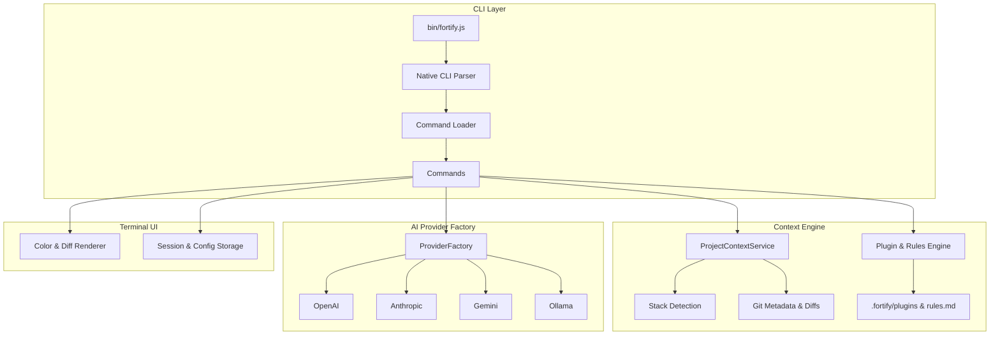

<div>

<br/>

# Fortify

### Your AI-Powered Terminal Copilot — Repo-Aware, Multi-Provider, Zero Dependencies

<br/>

[](https://www.npmjs.com/package/fortify-ai-cli)
[](https://github.com/jatin-awankar/fortify/actions)
[](LICENSE)
[](https://nodejs.org/)
[](#-why-zero-dependencies)
[](CONTRIBUTING.md)

<br/>


<br/>

**Chat with your codebase · Generate smart commits · Explain errors instantly**
**Switch between OpenAI, Claude, Gemini & Ollama with one command**

<br/>

[Get Started](#-get-started) · [Features](#-features) · [Commands](#-commands) · [Providers](#-providers) · [Plugins](#-plugins--rules) · [Architecture](#-architecture) · [Contributing](#-contributing)

</div>

<br/>

---

<br/>

## Why Fortify?

Most AI CLI tools are thin wrappers around a single API. Fortify is different — it's a **full terminal-native development environment** that understands your repo, respects your privacy, and works with the models _you_ choose.

<table>
<tr>
<td width="50%">

### 🧠 Repo-Aware Intelligence

Fortify reads your `package.json`, `Cargo.toml`, `pyproject.toml`, or `go.mod`, detects your git branch & diff state, and injects workspace context into every prompt — automatically.

</td>
<td width="50%">

### ⚡ Instant & Lightweight

Zero runtime dependencies. Pure Node.js ESM. Sub-second install. `<10ms` cold startup. No SDK bloat, no supply-chain risk.

</td>
</tr>
<tr>
<td width="50%">

### 🔌 Any Model, Your Choice

OpenAI GPT-4o · Anthropic Claude 3.5 Sonnet · Google Gemini · Ollama local models — switch providers with a single config change.

</td>
<td width="50%">

### 🖥️ Claude Code-Level TUI

Live action cards, animated spinners, git-style diff previews, tab-complete for `@files` and `/commands`, interactive permission prompts — all in your terminal.

</td>
</tr>
</table>

<br/>

---

<br/>

## 🚀 Get Started

### Install

```bash
# npm
npm install -g fortify-ai-cli

# pnpm
pnpm add -g fortify-ai-cli

# yarn
yarn global add fortify-ai-cli

# bun
bun add -g fortify-ai-cli

# or run without installing
npx fortify-ai-cli --help
```

### Set Up

```bash
# 1 — authenticate with your AI provider (interactive wizard)
fortify auth

# 2 — initialize workspace context in your project root
fortify init

# 3 — start chatting
fortify chat
```

That's it. Three commands and you're in.

<br/>

---

<br/>

## ✨ Features

### Interactive Chat REPL

Start a rich terminal AI session with full repo awareness:

```bash
fortify chat
```

```text
┌──────────────────────────────────────────────────────────────────────────┐
│ Fortify v0.9.0 | Model: gpt-4o (openai) | Session: sess-8f92a            │
└──────────────────────────────────────────────────────────────────────────┘
Commands: /help, /clear, /diff, /commit, /exit │ Files: @filename
────────────────────────────────────────────────────────────────────────────
You > Refactor @src/services/chat-service.js to optimize token usage

[1/3] Discovering workspace structure & context...
  ✓ Read src/services/chat-service.js (32 lines)

[2/3] Generating diff preview...
╭─ src/services/chat-service.js +2 -1 ─╮
│ @@ -15,4 +15,5 @@                    │
│ -const TIMEOUT_MS = 1000;            │
│ +const TIMEOUT_MS = 5000;            │
│ +const RETRY = true;                 │
╰──────────────────────────────────────╯

[3/3] Awaiting approval...
  ? Allow updating src/services/chat-service.js? [Y/n]
```

- **`@file` tab completion** — reference any file in your workspace
- **Slash commands** — `/help`, `/clear`, `/model`, `/tools`, `/history`, `/exit`
- **Session resume** — pick up where you left off with `--resume`
- **Agentic tool loop** — multi-turn LLM ↔ tool execution with safety rails

---

### AI Commit Messages

Generate, review, and edit commit messages from your staged diffs:

```bash
fortify commit --interactive --validate
```

- Opens your `$EDITOR` / `$VISUAL` / `code --wait` for live editing
- Validates against [Conventional Commits](https://www.conventionalcommits.org/) format
- `--dry-run` to preview without committing

---

### Error Explainer

Paste an error, get an instant explanation:

```bash
fortify explain "TypeError: Cannot read properties of undefined (reading 'map')"
```

---

### Codebase Summarizer

Get a structural overview of any directory:

```bash
fortify summarize src/
```

---

### Permission System

Fortify **never** modifies files or runs commands without your approval:

```text
? Allow updating src/services/chat-service.js? [Y] Allow [n] Deny [a] Allow all [?] Explain
```

<br/>

---

<br/>

## 📖 Commands

| Command             | What it Does                           | Key Flags                                   |
| :------------------ | :------------------------------------- | :------------------------------------------ |
| `fortify init`      | Scaffold `.fortify/` workspace context | `-y` skip prompts                           |
| `fortify auth`      | Interactive API key setup wizard       | `--provider <name>`                         |
| `fortify chat`      | Launch AI chat REPL                    | `--resume`, `--session <id>`                |
| `fortify commit`    | AI-generated commit messages           | `-i` interactive, `--validate`, `--dry-run` |
| `fortify explain`   | Explain errors or code                 | Inline string or file path                  |
| `fortify summarize` | Recursive codebase summary             | Directory path (default `.`)                |
| `fortify plugin`    | Manage prompt shortcuts                | `list`, `init`                              |
| `fortify config`    | Read/write CLI settings                | `list`, `get`, `set`, `validate`            |
| `fortify history`   | Manage saved sessions                  | `list`, `--show <id>`, `--clear`            |

<br/>

---

<br/>

## 🔌 Providers

Switch between providers at any time — no code changes required.

### OpenAI

```bash
fortify config set provider openai
fortify config set model gpt-4o
fortify config set apiKeys.openai "sk-..."
```

### Anthropic (Claude)

```bash
fortify config set provider anthropic
fortify config set model claude-3-5-sonnet-20241022
fortify config set apiKeys.anthropic "sk-ant-..."
```

### Google Gemini

```bash
fortify config set provider gemini
fortify config set model gemini-2.0-flash
fortify config set apiKeys.gemini "AI..."
```

### Ollama (Local / Privacy-First)

Run models like `llama3`, `deepseek-r1`, `qwen2.5` entirely on your machine:

```bash
fortify config set provider ollama
fortify config set baseUrl "http://localhost:11434"
fortify config set model llama3
```

> **Tip:** You can also set keys via environment variables: `OPENAI_API_KEY`, `ANTHROPIC_API_KEY`, `GEMINI_API_KEY`

<br/>

---

<br/>

## 🧩 Plugins & Rules

### Workspace Rules

`fortify init` creates `.fortify/rules.md` — instructions injected into every AI prompt:

```markdown
# Repository Coding Rules

- Use ES Modules (`import/export`).
- Always write JSDoc comments for public methods.
- Enforce strict error handling with custom Error subclasses.
```

### Prompt Shortcuts

Create reusable prompt templates in `.fortify/plugins/`. Example — `.fortify/plugins/security-check.md`:

```markdown
Review the referenced code for OWASP top 10 vulnerabilities,
unhandled promises, and sensitive key leaks.
```

Then use it instantly:

```text
You > Check @src/index.js with @security-check
```

Manage plugins with:

```bash
fortify plugin list    # see available shortcuts
fortify plugin init    # scaffold a new plugin
```

<br/>

---

<br/>

## 📊 Comparison

| Capability                                         | Fortify | GitHub Copilot CLI | Aider | Cursor CLI |
| :------------------------------------------------- | :-----: | :----------------: | :---: | :--------: |
| Repo & stack auto-detection                        |   ✅    |         ❌         |  ❌   |     ⚠️     |
| Interactive `$EDITOR` integration                  |   ✅    |         ❌         |  ❌   |     ❌     |
| Multi-provider (OpenAI + Claude + Gemini + Ollama) |   ✅    |         ❌         |  ✅   |     ❌     |
| Workspace plugins & rules                          |   ✅    |         ❌         |  ❌   |     ❌     |
| Tab-complete `@file` references                    |   ✅    |         ❌         |  ✅   |     ❌     |
| Conventional Commits validation                    |   ✅    |         ❌         |  ❌   |     ❌     |
| Session persistence & resume                       |   ✅    |         ❌         |  ⚠️   |     ❌     |
| Local-only / privacy-first LLMs                    |   ✅    |         ❌         |  ✅   |     ❌     |
| Zero runtime dependencies                          |   ✅    |         ❌         |  ❌   |     ❌     |

<br/>

---

<br/>

## 🏗️ Architecture



#### Directory Layout

```
fortify/
├── bin/fortify.js              # CLI entry point
├── src/
│   ├── commands/               # chat, commit, explain, summarize, init, auth, ...
│   ├── services/               # context engine, provider factory, agentic loop
│   │   ├── openai/             # OpenAI provider
│   │   ├── anthropic/          # Anthropic provider
│   │   ├── gemini/             # Gemini provider
│   │   └── ollama/             # Ollama provider
│   ├── renderers/              # terminal UI, spinners, diff cards, action cards
│   ├── config/                 # configuration store & app metadata
│   ├── prompts/                # system prompt templates
│   ├── storage/                # session & history persistence
│   └── utils/                  # shared utilities
├── test/                       # node:test unit & integration tests
├── .fortify/                   # workspace context (created by `fortify init`)
└── docs/                       # showcase website
```

<br/>

---

<br/>

## 💎 Why Zero Dependencies?

Fortify has **`"dependencies": {}`** in `package.json` — literally zero runtime third-party packages.

| What others use | What Fortify uses instead                        |
| :-------------- | :----------------------------------------------- |
| `openai` SDK    | Native `fetch` + SSE `TextDecoder` stream parser |
| `chalk`         | `node:util` `styleText` + custom ANSI utility    |
| `ora`           | Native braille-frame `NativeSpinner`             |
| `commander`     | `node:util` `parseArgs` CLI router               |

**Result:** Sub-second installs, `<10ms` startup, and zero supply-chain attack surface.

<br/>

---

<br/>

## 🧪 Development

```bash
# clone & install
git clone https://github.com/jatin-awankar/fortify.git
cd fortify
npm install

# run tests (272+ tests, 0 failures)
npm test

# full publish verification
npm run verify

# test the CLI locally
node ./bin/fortify.js --help

# link globally for local dev
npm link
```

See [CONTRIBUTING.md](CONTRIBUTING.md) for PR guidelines, architecture rules, and commit conventions.

<br/>

---

<br/>

<div>

## 📄 License

MIT — see [LICENSE](LICENSE) for details.

<br/>

Built with ❤️ by [Jatin Awankar](https://github.com/jatin-awankar)

<br/>

**[⬆ Back to Top](#️-fortify)**

</div>
