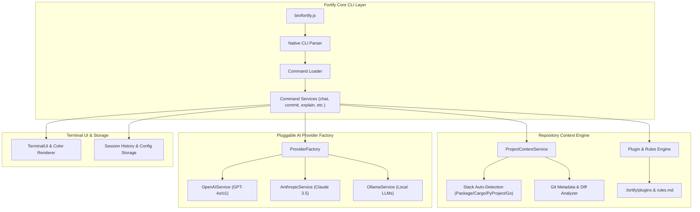

<div align="center">

# Fortify AI CLI

**The Repo-Aware, Multi-Provider Terminal AI Assistant for Modern Engineering**

[](https://www.npmjs.com/package/fortify-ai-cli)
[](https://github.com/jatin-awankar/fortify/actions)
[](LICENSE)
[](https://nodejs.org/)
[](CONTRIBUTING.md)

[Quickstart](#-quickstart) • [Features](#-key-features) • [Comparison](#-feature-comparison) • [Commands](#-command-reference) • [Providers & Config](#-provider--configuration-guide) • [Architecture](#-architecture)

</div>

---

### 💻 Interactive Terminal Experience

```text
  ███████╗ ██████╗ ██████╗ ████████╗██████╗███████╗██╗   ██╗
  ██╔════╝██╔═══██╗██╔══██╗╚══██╔══╝╚═██╔═╝██╔════╝╚██╗ ██╔╝
  █████╗  ██║   ██║██████╔╝   ██║     ██║  █████╗   ╚████╔╝ 
  ██╔══╝  ██║   ██║██╔══██╗   ██║     ██║  ██╔══╝    ╚██╔╝  
  ██║     ╚██████╔╝██║  ██║   ██║   ██████╗██║        ██║   
  ╚═╝      ╚═════╝ ╚═╝  ╚═╝   ╚═╝   ╚═════╝╚═╝        ╚═╝   

  🛡️ Fortify AI CLI v0.6.3
  Workspace Signature: Node.js / ES Modules [git: main]
  Active Provider: OpenAI (gpt-4o)

  You > Refactor @src/services/chat-service.js to optimize token usage and apply @security-check

  ✦ Scanning workspace signature & context...
  ✦ Injecting @src/services/chat-service.js (3.2 KB, 94 lines)
  ✦ Executing plugin rule: @security-check...

  Fortify > Refactored prompt builder to stream tokens and prune redundant context.
  
  [+] Created diff chunk (2 insertions, 8 deletions)
  [?] Launch interactive editor to apply changes? (Y/n)
```

---

## ⚡ Key Features

Fortify is built to stand among the **Top 1% developer CLI tools**. Unlike simple LLM wrappers, Fortify brings **deep repository context**, **native `$EDITOR` integration**, **interactive file auto-completion**, **pluggable cloud & local AI engines**, and **team project rules** directly to your terminal.

- 🧠 **Repo-Aware Context Engine**: Automatically detects workspace signatures (`package.json`, `Cargo.toml`, `pyproject.toml`, `go.mod`), active Git branch, diff status, and project architecture.
- 📎 **Smart `@file` Attachments & Autocomplete**: Reference files in prompts using `@src/app.js` with real-time readline tab-completion, automated payload size guards, and syntax checks.
- ✏️ **Interactive `$EDITOR` Commit Workflow**: Draft high-quality git commit messages and review/edit them live in `$EDITOR`, `$VISUAL`, `code --wait`, `notepad`, or `nano` before committing (`fortify commit -i`), enforced by Conventional Commits validation (`--validate`).
- 🔌 **Pluggable AI Backends**: Switch seamlessly between **OpenAI (GPT-4o/o1)**, **Anthropic (Claude 3.5 Sonnet)**, and **Local Models via Ollama** (`llama3`, `deepseek-r1`, `qwen2.5`) with zero code changes.
- 🧩 **Workspace Prompt Shortcuts & Rules**: Define project-level prompt templates (e.g., `@security-check`, `@refactor`, `@test-suite`) in `.fortify/plugins/` and enforce repository coding guidelines via `.fortify/rules.md`.
- 💾 **Stateful Session Resume**: Persist conversation contexts, resume past interactive sessions (`fortify chat --resume`), or inspect chat history (`fortify history`).
- 🎨 **Rich Terminal UX**: Beautiful cyan ASCII branding, responsive border containers, dynamic diff highlighting (`+` green, `-` red, `@@` cyan), and animated `ora` loading spinners.

---

## 📊 Feature Comparison

| Feature | 🛡️ Fortify CLI | GitHub Copilot CLI | Aider | Cursor CLI |
| :--- | :---: | :---: | :---: | :---: |
| **Repo Signature & Stack Auto-Detection** | ✓ **Native (`fortify init`)** | ✘ | ✘ | ⚠️ Basic |
| **Interactive Terminal `$EDITOR` Integration** | ✓ **Native (`-i / --interactive`)** | ✘ | ✘ | ✘ |
| **Pluggable Backends (OpenAI, Claude 3.5, Ollama)** | ✓ **Native** | ✘ (OpenAI only) | ✓ | ✘ (Proprietary) |
| **Workspace Prompt Shortcuts (`.fortify/plugins`)** | ✓ **Native** | ✘ | ✘ | ✘ |
| **Tab Autocomplete `@file` References** | ✓ **Native** | ✘ | ✓ | ✘ |
| **Conventional Commits Validator** | ✓ **Native (`--validate`)** | ✘ | ✘ | ✘ |
| **Persistent Session Resume** | ✓ **Native (`--resume`)** | ✘ | ⚠️ Limited | ✘ |
| **Local / Privacy-First LLMs (Ollama)** | ✓ **Native** | ✘ | ✓ | ✘ |

---

## 🚀 Quickstart

### Installation

Install globally using your favorite package manager:

```bash
# via npm
npm install -g fortify-ai-cli

# via pnpm
pnpm add -g fortify-ai-cli

# via yarn
yarn global add fortify-ai-cli

# via bun
bun add -g fortify-ai-cli
```

Or run directly without global installation:

```bash
npx fortify-ai-cli --help
```

---

### Step-by-Step Setup

#### 1. Authenticate / Configure Provider

Set up your OpenAI or Anthropic API key with the interactive wizard:

```bash
fortify auth
```

Alternatively, set your key directly or use environment variables:

```bash
# Configure Anthropic Claude
fortify config set provider anthropic
fortify config set apiKeys.anthropic "sk-ant-api..."

# Or via environment variables
export OPENAI_API_KEY="sk-..."
export ANTHROPIC_API_KEY="sk-ant-..."
```

#### 2. Initialize Your Workspace

Run `fortify init` in your project root to auto-detect your stack and create repository context guidelines (`.fortify/rules.md`):

```bash
fortify init
```

#### 3. Launch Interactive Terminal REPL

Start an interactive AI chat session with `@file` path auto-completion:

```bash
fortify chat
```

Inside the chat prompt:
```text
You > Explain the authentication logic in @src/services/auth-service.js and apply @refactor
```

#### 4. Generate & Review AI Commits

Draft git commit messages based on staged/unstaged changes and edit them in your terminal `$EDITOR`:

```bash
fortify commit --interactive --validate
```

---

## 📖 Command Reference

| Command | Description | Key Flags & Options | Example Usage |
| :--- | :--- | :--- | :--- |
| **`fortify init`** | Initialize workspace context (`.fortify/project.json`, `.fortify/rules.md`) | `-y, --yes` (skip prompts) | `fortify init` |
| **`fortify auth`** | Interactive authentication & provider wizard | `--provider <name>` | `fortify auth` |
| **`fortify chat`** | Start interactive AI assistant REPL | `-r, --resume`, `--session <id>` | `fortify chat --resume` |
| **`fortify commit`** | Draft AI commit messages from git diffs | `-i, --interactive`, `--validate`, `--dry-run` | `fortify commit -i --validate` |
| **`fortify explain`** | Explain errors, stack traces, or code files | Inline error string or file path | `fortify explain "TypeError: undefined"` |
| **`fortify summarize`** | Summarize workspace structure & codebase recursively | Directory path (default: `.`) | `fortify summarize src/` |
| **`fortify plugin`** | Manage prompt shortcuts & custom rules | `list`, `init` | `fortify plugin list` |
| **`fortify config`** | Inspect, set, and validate CLI configuration | `list`, `get <key>`, `set <key> <val>`, `validate` | `fortify config set model gpt-4o` |
| **`fortify history`** | Manage saved interactive chat sessions | `list`, `--show <id>`, `--clear` | `fortify history list` |

---

## 🔌 Provider & Configuration Guide

Fortify supports multiple cloud AI providers as well as local zero-telemetry LLMs.

### 1. OpenAI Config
```bash
fortify config set provider openai
fortify config set model gpt-4o
fortify config set apiKeys.openai "sk-..."
```

### 2. Anthropic Config
```bash
fortify config set provider anthropic
fortify config set model claude-3-5-sonnet-20241022
fortify config set apiKeys.anthropic "sk-ant-..."
```

### 3. Local Ollama Config (Privacy First)
Ensure [Ollama](https://ollama.ai/) is running locally, then configure Fortify:

```bash
fortify config set provider ollama
fortify config set baseUrl "http://localhost:11434"
fortify config set model llama3
```

---

## 🛠️ Custom Plugins & Team Project Rules

Fortify allows teams to standardize prompts and enforce codebase rules across environments.

### Workspace Rules (`.fortify/rules.md`)
Created during `fortify init`. Fortify injects these instructions into every prompt:

```markdown
# Repository Coding Rules
- Use ES Modules (`import/export`).
- Always write JSDoc comments for public methods.
- Enforce strict error handling with custom Error subclasses.
```

### Prompt Shortcuts (`.fortify/plugins/`)
Create custom `.md` or `.json` prompt shortcuts. For example, `.fortify/plugins/security-check.md`:

```markdown
Review the referenced code specifically for OWASP top 10 security vulnerabilities, unhandled promises, and sensitive key leaks.
```

Then invoke it instantly in chat:
```text
You > Check @src/index.js with @security-check
```

---

## 🏗️ Architecture



---

## 🧪 Development & Verification

To contribute to Fortify CLI or test local changes:

1. Clone the repository and install dependencies:
   ```bash
   git clone https://github.com/jatin-awankar/fortify.git
   cd fortify
   npm install
   ```

2. Run unit tests:
   ```bash
   npm test
   ```

3. Run package verification pipeline:
   ```bash
   npm run verify
   ```

---

## 📄 License

Distributed under the MIT License. See [LICENSE](LICENSE) for details.

Developed with ❤️ by [Jatin Awankar](https://github.com/jatin-awankar)
